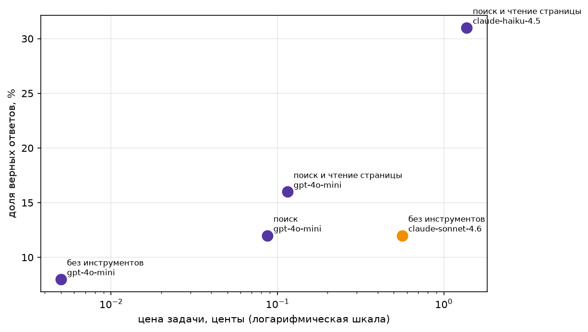

# ReAct: викторина по ЧМ-2026 и сравнение моделей

Учебный репозиторий с семинара про ReAct-агентов. Две задачи:

1. собрать датасет вопросов для проверки вызовов разных LLM;
2. сравнить модели с инструментами и без них.

Материал для вопросов — 104 матча чемпионата мира 2026 года по статьям английской
Википедии. События свежие: «из головы» модель их почти не знает, поэтому разрыв между
конфигурацией «без инструментов» и «с поиском» виден сразу и его можно измерить.

## Установка

```bash
uv sync
cp .env.example .env   # и заполнить ключ
```

Переменные окружения:

| Переменная | Зачем |
| --- | --- |
| `OPENROUTER_API_KEY` | вызовы моделей через OpenRouter (эксперимент и оценка) |
| `MATCH_QUIZ_MODEL` | модель для генерации вопросов, по умолчанию `haiku` |
| `CLAUDE_CODE_OAUTH_TOKEN` | токен для claudi cli, только для генерации вопросов |

Для шага 3 сборки датасета дополнительно нужен установленный `claude` CLI — вопросы
генерируются через него, а не через OpenRouter.

## Структура

| Путь | Что внутри |
| --- | --- |
| [lesson/](lesson/) | материалы семинара: `fetch_fresh.py`, `fresh_2026.jsonl`, задание |
| [utils/](utils/) | вся логика: сбор ссылок, описаний, генерация и оценка викторины |
| [data/](data/) | датасеты на всех стадиях сборки |
| [main.py](main.py) | агентный цикл и прогон эксперимента |
| [tests/](tests/) | тесты инструментов агента |
| [traces/](traces/) | пошаговые трейсы каждого вопроса |
| [report.md](report.md) | вывод эксперимента |

Скрипты в корне (`extract_match_links.py`, `extract_match_descriptions.py`,
`generate_match_quiz.py`, `evaluate_match_quiz.py`) — тонкие обёртки над модулями из
`utils/`: разбирают аргументы и печатают итог.

## Тесты

Pytest лежит в группе `dev`, её нужно поставить отдельно от основных зависимостей:

```bash
uv sync --group dev          # один раз
uv run pytest                # весь набор
uv run pytest -q             # только итог
uv run pytest tests/test_tools.py::test_web_search_returns_intro_and_other_titles   # один тест
```

Настройки — в `[tool.pytest.ini_options]` файла `pyproject.toml`: тесты берутся из
`tests/`, корень репозитория добавлен в `pythonpath`, поэтому `import main` работает без
установки пакета.

Покрыты инструменты агента — `web_search` и `page_find`
([tests/test_tools.py](tests/test_tools.py)), для каждого три случая: нормальный вход,
пустой результат, ошибка. Плюс `run_tool` — как ошибку инструмента видит агент. Сеть не
задействована: единственная точка выхода наружу, `wiki()`, подменяется фикстурой
`install_wiki` из [tests/conftest.py](tests/conftest.py); она же выставляет тестовый
`OPENROUTER_API_KEY` до импорта `main`, так что тесты идут без `.env` и без ключа.

## Как собран `data/fresh.jsonl`

Три шага, каждый пишет свой файл в `data/`. Шаги независимы: можно перезапустить любой,
не трогая предыдущие.

```
2026_FIFA_World_Cup (Википедия)
        │  шаг 1: ссылки на матчи
        ▼
data/matches                     104 URL с якорями
        │  шаг 2: текст секции каждого матча
        ▼
data/match_descriptions.jsonl    {"url", "text"}
        │  шаг 3: один вопрос на описание (claude CLI)
        ▼
data/fresh.jsonl                 готовая викторина
```

### Шаг 1. Ссылки на матчи

```bash
uv run python extract_match_links.py
```

Логика — в [utils/wiki_links.py](utils/wiki_links.py):

- `fetch_html()` (httpx, async) забирает статью `en.wikipedia.org/wiki/2026_FIFA_World_Cup`;
- `LINK_RE` вытаскивает из HTML ссылки вида `/wiki/2026_FIFA_World_Cup_*#Fragment`;
- остаются только якоря с `_vs_` в имени плюс два особых (`Final` и
  `Match_for_third_place` — у них в URL нет названий команд), дубли отбрасываются;
- результат: `data/matches`, по одному абсолютному URL на строку, 104 штуки.

### Шаг 2. Описания матчей

```bash
uv run python extract_match_descriptions.py
```

Логика — в [utils/match_descriptions.py](utils/match_descriptions.py):

- каждый URL режется на базовую страницу и якорь; качаются только уникальные базовые
  страницы (статьи групп и плей-офф), httpx async с `asyncio.Semaphore(5)`;
- `extract_match_info()` на BeautifulSoup находит заголовок матча по якорю и забирает всё
  до следующего заголовка, складывая три куска текста:
  - `footballbox` — дата, счёт, авторы голов, стадион, посещаемость, судья;
  - параграфы прозы — контекст матча, рекорды, происшествия;
  - таблицы составов и судейской бригады;
- скрытые микроформатные элементы (`span.bday` и прочее с `display:none`) выкидываются,
  чтобы даты не дублировались в тексте;
- результат: `data/match_descriptions.jsonl`, 104 строки `{"url", "text"}`.

### Шаг 3. Вопросы

```bash
uv run python generate_match_quiz.py
```

Логика — в [utils/match_quiz.py](utils/match_quiz.py). На каждое описание делается один
вызов `claude` CLI через `subprocess`:

```
claude -p --system-prompt <SYSTEM_PROMPT> --output-format json
       --json-schema <схема GeneratedQuestion> --no-session-persistence
       --tools "" --model $MATCH_QUIZ_MODEL
```

Важные детали вызова:

- `--tools ""` — модель работает только по тексту описания, без веба, поэтому вопрос не
  может «уехать» в факты, которых нет в исходнике;
- `--json-schema` строится из pydantic-модели `GeneratedQuestion`
  (`question`, `answer`, `evidence`), ответ дополнительно валидируется ей же;
- если CLI упал, вернул не-JSON или ответ не прошёл валидацию, строка просто пропускается
  (`ask_claude` возвращает `None`) — поэтому вопросов может оказаться меньше, чем матчей.

Правила из `SYSTEM_PROMPT`, которые и задают характер датасета:

- ответ — одна сущность не длиннее пяти слов (имя, число, название, место, дата) и
  встречается в описании дословно;
- вопрос самодостаточный: обязательно называет обе команды и стадию турнира, чтобы матч
  опознавался без исходного текста;
- ответа в тексте вопроса быть не должно;
- предпочтение необычному факту — рекорд, судейская деталь, удаление, пенальти, автогол,
  посещаемость, история встреч — а не дежурному «кто забил» или «лучший игрок матча»;
- факты не про сам ЧМ-2026, а также будущие и запланированные события не берутся.

### Формат строки

| Поле | Что это |
| --- | --- |
| `id` | `fresh-N`, сквозная нумерация по порядку записи |
| `source` | всегда `fresh` — так же помечены вопросы из `lesson/fresh_2026.jsonl` |
| `question` | вопрос на английском |
| `answer` | эталонный короткий ответ |
| `evidence` | фрагмент описания, из которого взят ответ |
| `page` | название статьи Википедии |
| `url` | ссылка на конкретный матч (со якорем) |

Первая строка датасета:

```json
{
  "id": "fresh-0",
  "source": "fresh",
  "question": "In the Czech Republic vs South Africa group stage match, referees Tori Penso, Brooke Mayo, and Kathryn Nesbitt became the first all-female on-field refereeing trio from which country at a men's FIFA World Cup?",
  "answer": "United States",
  "evidence": "By officiating this match, referees Tori Penso, Brooke Mayo, and Kathryn Nesbitt became the second all-female on-field refereeing trio, and the first from the United States, to take charge of a match at a men's FIFA World Cup.",
  "page": "2026 FIFA World Cup Group A",
  "url": "https://en.wikipedia.org/wiki/2026_FIFA_World_Cup_Group_A#Czech_Republic_vs_South_Africa"
}
```

### О чём помнить

- вопросы и ответы на английском — так же, как статьи-источники;
- ответ засчитывается, если нормализованный эталон входит **подстрокой** в ответ модели
  (`is_correct` в [main.py:209](main.py#L209), `graded` в
  [utils/evaluate_quiz.py](utils/evaluate_quiz.py)); отсюда и требование к короткому
  ответу в промпте — длинный эталон таким способом не проверить.

## Эксперимент: с инструментами и без

```bash
uv run python main.py --levels cheap --configs "поиск и чтение страницы" --limit 10
```

[main.py](main.py) гоняет вопросы через ReAct-цикл. Инструменты поверх Wikipedia API:
`web_search` (интро лучшей статьи и заголовки ещё двух) и `page_find` (строки полного
текста статьи с ключевыми словами). Наборы инструментов заданы в `CONFIGS` — «без
инструментов», «поиск», «поиск и чтение страницы», модели — в `MODELS`
(`cheap`, `mid`, `strong`). Запускается любое сочетание: каждый набор × каждая модель.

Что остаётся после прогона: трейс каждого вопроса в `traces/<конфиг>/<модель>/<id>.json`,
таблица прогона в `results/<конфиг>__<уровень>.csv` и общая `results/all_runs.csv`, сводка
по точности и цене — в консоли.

Второй, более узкий прогон:

```bash
uv run python evaluate_match_quiz.py --concurrency 5
```

[evaluate_match_quiz.py](evaluate_match_quiz.py) поверх
[utils/evaluate_quiz.py](utils/evaluate_quiz.py) отвечает на каждый вопрос дважды —
сильной моделью в одиночку и агентом с инструментами (оба ответчика берутся из
`lesson/fetch_fresh.py`) — и пишет `data/match_quiz_evaluated.jsonl`: исходная строка плюс
`sonnet_answer` / `sonnet_ok` / `agent_answer` / `agent_ok`. Прогон докатывается: уже
оценённые `id` при повторном запуске не переспрашиваются (`--no-resume`, чтобы всё-таки
переспросить).

## Результаты

Все прогоны из [report.md](report.md) одной таблицей, по возрастанию цены вопроса:

| Конфигурация | Модель | n | Точность | $/вопрос | $/верный ответ | Шагов | Секунд |
| --- | --- | --- | --- | --- | --- | --- | --- |
| без инструментов | gpt-4o-mini | 104 | 0.08 | 0.00005 | 0.00070 | 1.00 | 1.6 |
| поиск | gpt-4o-mini | 104 | 0.12 | 0.00087 | 0.00755 | 5.97 | 10.2 |
| поиск и чтение страницы | gpt-4o-mini | 104 | 0.16 | 0.00115 | 0.00702 | 7.11 | 11.9 |
| без инструментов | claude-sonnet-4.6 | 104 | 0.12 | 0.00563 | 0.04882 | 1.00 | 6.5 |
| поиск и чтение страницы | claude-haiku-4.5 | 104 | 0.31 | 0.01374 | 0.04465 | 5.22 | 14.7 |

Те же пять прогонов на плоскости «цена — качество» (`money_chart` в
[main.py:280](main.py#L280), ось цены логарифмическая):



Что видно из таблицы:

- на одной и той же модели инструменты добавляют точность монотонно: у gpt-4o-mini
  0.08 → 0.12 → 0.16;
- инструменты выгоднее, чем переход на более сильную модель: haiku-4.5 с двумя
  инструментами даёт 0.31* против 0.12 у sonnet-4.6 без инструментов, и верный ответ у
  него обходится дешевле (0.04465 против 0.04882) — хотя сам вопрос стоит дороже;
- самый дешёвый верный ответ — у gpt-4o-mini без инструментов (0.00070), но это всего
  8 попаданий из 104: дёшево ровно потому, что модель отвечает одним шагом и почти
  всегда мимо;
- цена и время идут за числом шагов: 1 шаг ≈ 1.6 с, 7.11 шага ≈ 11.9 с.

* Результат немного занижен, так как на прогоне haiku-4.5 некоторые запросы вылетели по rate limit.
Необходимо в post_with_retry учитывать ответ от Openrouter со временем следующего перезапроса.

Абсолютные числа низкие: сказываются и сложность вопросов (датасет намеренно собран
вокруг необычных деталей), и строгая проверка ответа по подстроке. Сырой вывод прогонов,
токены и суммарная цена — в [report.md](report.md).

Интересное наблюдение, что при использовании единого промта (для честного результаты), мы
указывали в промте необходимость использования инструментов. В этом случае claude-sonnet-4.6 и 
laude-haiku-4.5 в ответе имитировала вызов инструмента, в одном прогоне возвращая и вопрос, и ответ.
gpt-4o-mini так не делала.

## Разбор кейсов

1. traces/поиск и чтение страницы/claude-haiku-4.5/fresh-7.json: не достаточно точно сформулирован поисковый запрос,
нужна информация не найдена, инетересно, что некоторые вопросы уходили совсем не туда (баскетбол, внутренний чемпионат);

2. traces/поиск и чтение страницы/claude-haiku-4.5/fresh-97.json: тут проблема с вопросом, так как
в вопросе укзано Final, видимо подразумевалась Final stage, то и поисковый запрос сформировался на поиск финала.
Была найдена нужная статья, и модель решила, что в вопросе была ошибка, и финальный матч был не между Испанией и Бельгией, а
между Испанией и Аргентиной. В итоге за одну итерации вызова инструмента решила выдать ответ, не попытавшись перепроверить.